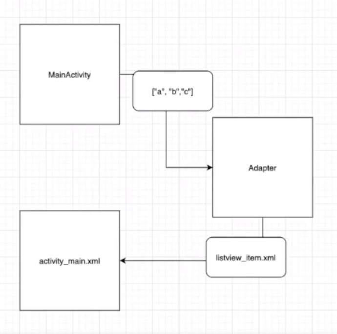

# ListView와 Adapter

- MainActivity에서 데이터를 만들고, Adapter로 보낸다.
- Adapter에서 받은 데이터마다의 listview item을 만든다
- Adapter에서 만든 item을 activity_main의 listview로 넘겨준다.
<br>
-> MainActivity에서 데이터를 Adapter에 넘겨주면, Adapter가 넘겨받은 데이터 하나하나에 해당하는 리스트뷰를 만들고, 그 리스트를 activity_main의 listview로 넘겨준다.
<br>
<br>


## 리스트뷰 만들기
1) activity_main에서 ListView를 만든다.
```kotlin
<ListView
	android:id="@+id/mainListView"
	android:layout_width="match_parent"
	android:layout_height="match_parent"/>
```
<br><br>


2) MainActivity에서 Adapter로 데이터를 넘겨줘야 함. 그런데 Adapter가 없으므로 Adapter를 만들어야 함
```kotlin
class ListViewAdapter(val List : MutableList<String>) : BaseAdapter() {
	override fun getCount(): Int {
		return List.size
	}

	override fun getItem(position: Int): Any {
		return List[position]
	}

	override fun getItemId(position: Int): Long {
		return position.toLong()
	}

	override fun getView(position: Int, convertView: View?, parent: ViewGroup?): View{
	
	}
}
```
### 코드 설명
- ListViewAdapter 클래스를 만든다.
- ListViewAdapter는 MainActivity에서 넘겨준 데이터를 받아야함
	- -> 데이터형에 맞게 인자 설정
- getCount() : listView의 개수(item의 개수)
	- item의 개수는 List의 크기로 설정
- getView() : item에 값을 하나씩 넣어줌
	- 그림에서 Adapter -> listview_item.xml
	- 이를 위해 item이 있는 listview_item.xml 파일을 만들어야 함
<br>
3) layout에 listview_item 파일을 만든다.


```kotlin
<LinearLayout
	...
	android:layout_height="80dp">

	<TextView
		android:id="@+id/listviewItem"
		android:textSize="30sp"
		android:layout_margin="5dp"
		android:text="리스트뷰 아이템"
		android:layout_width="wrap_content"
		android:layout_height="wrap_content"/>
</LinearLayout>
```
### 코드 설명
- 각 아이템의 height를 80dp로 설정
- 이제 아이템이 만들어졌다. 이 아이템을 Adapter에서 연결해줘야 함
	- -> ListViewAdapter의 getView()

<br><br>
<br>


4) ListViewAdapter에서 item을 연결한다
```kotlin
	override fun getView(position: Int, convertView: View?, parent: ViewGroup?): View {
		
		var convertView = convertView

		if (convertView == null) {
			conertView = LayoutInFlater.from(parent?.context).inflate(R.layout.listview_item, parent, false)
		}

		return convertView!!
	}
```
### 코드 설명
- getView의 인자인 convertView를 이용해서 item과 연결
- `if (convertView == null) ... ` : 이 부분이 item을 가져오는 부분이다. item이 listview_item에 있으므로, 인자로 R.layout.listview_item을 준다.
- 이후 convertView!!를 return 한다.
<br>
<br>
<br>


5) 이제 MainActivity에서 리스트뷰 아이템의 데이터를 넣어준다.
```kotlin
val list_item = mutableListOf<String>()

list_item.add("A")
list_item.add("B")
list_item.add("C")

val adapter = ListViewAdapter(list_item)
```
- MainActivity에서 adapter로 데이터를 넘겨주고, adapter가 activity_main으로 listview를 넘겨준다.
- 위 코드는 MainActivity에서 adapter로 데이터를 넘겨주기까지의 부분이다.
<br>
### 코드 설명
- adapter로 넘겨줄 데이터를 만든다.
- 생성한 데이터를 이전에 생성한 ListViewAdapter에 넘겨준다.
- 위에서 Adapter와 listview_item.xml을 연결해놨으므로, list_view.xml과 activity_main.xml에 listview를 연결하는 작업만 하면 된다.

<br>
<br>
<br>


6) list_view_xml과 activity_main_xml 연결
```kotlin
	val listview = findViewById<List>(R.id.mainListView)

	val listAdapter = ListViewAdapter(list_item)
	listview.adapter = listAdapter
```
<br>
<br>
<br>


7) Adapter에서 받은 데이터를 list_view.xml에 하나씩 넣어줘야 함
- ListViewAdapter의 getView 부분 수정
```kotlin
	if (convertView == null) {
		...
	}

	var title = convertView!!.findViewById<TextView>(R.id.listviewItem)
	title.text = List[position]
```
<br>
### 코드 설명
- listviewItem을 받아와서, text를 List\[position\]으로 설정

<br>
<br><br>
<br>

## 리스트뷰에 데이터 모델 전달하기
- 위 예제에서는 리스트뷰에 문자열을 전달하였다.
- 문자열말고, 데이터 모델을 전달할 수도 있다.

<br>
1) ListViewModel 클래스 생성 (데이터 모델 생성)
```kotlin
data class ListViewModel {
	var title: String = "",
	var content: String = ""
}
```
이렇게 만들어진 모델을 Adapter에 전달할 수 있다.
<br>
2) MainActivity에서 String -> ListViewModel로 수정
```kotlin
val list_item = mutableListOf<ListViewModel>()

list_item.add(ListViewModel("a", "b"))
list_item.add(ListViewModel("c", "d"))
list_item.add(ListViewModel("e", "f"))

val listview = findViewById<ListView>(R.id.mainListView)

val listAdapter = ListViewAdapter(list_item)
listview.adapter = listAdapter
```
<br>
3) Adapter의 인자도 ListViewModel로 수정
```kotlin
class ListViewAdapter(val List: MutableList<ListViewModel>) : BaseAdapter() {
	...

	override fun getView(...) {
		...
		val title = convertView!!.findViewById<TextView>(R.id.listviewItem)
		val content = convertView!!>findViewById<TextView>(R.id.listviewItem2)
		title.text = List[position].title
		content.text = List[position].content	
	}
}
```